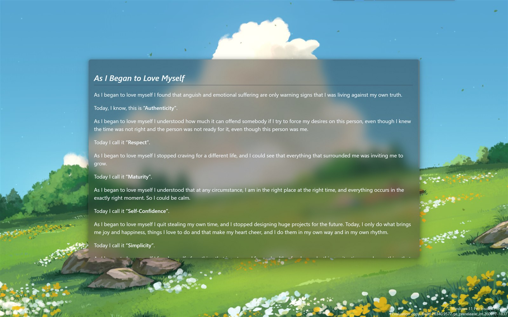
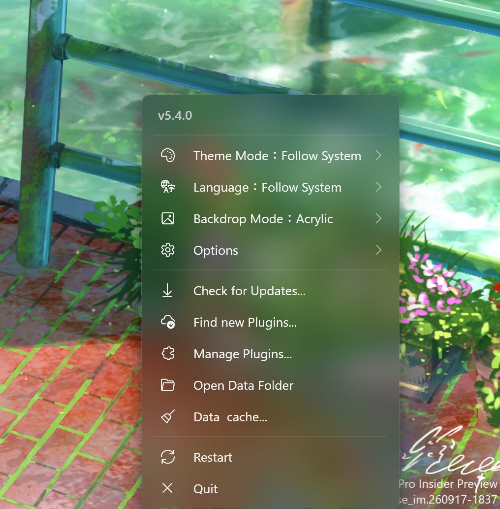
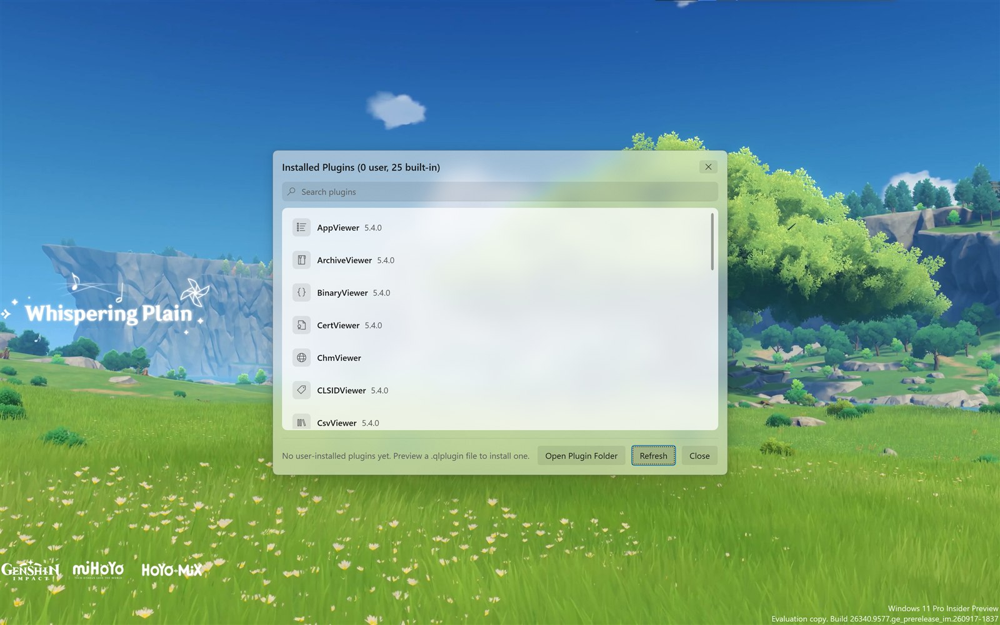

# QuickLook-Next

**English** | [简体中文](README.zh-CN.md)

> A **UI-polished and feature-complete** edition of [QuickLook](https://github.com/QL-Win/QuickLook)
> (ported to .NET 10, based on the 4.5.0 codebase).

QuickLook-Next keeps the full file-preview capability and rebuilds the experience:
preview backdrop, rounded corners, themes, tray menu, plugin manager, language
switching, auto-update — **more features, not fewer**.

It lives on the isolated `lite` branch (named pipes / mutex use `QuickLookNext.App.*`),
so it can be installed side-by-side with the official build without conflicts.

## Screenshots

All screenshots below show the app running in real use.

### Image preview

100+ image formats (png / jpg / gif / webp / bmp / psd / raw / heic / svg etc.)
with Acrylic backdrop from the first frame that follows the wallpaper, plus
native Win11 rounded corners.


### Markdown preview

Standard Markdown, mermaid diagrams and MathJax formulas with syntax
highlighting; content scrolls smoothly.



### Office preview (self-rendered; screenshot shows Excel)

Excel / Word / PowerPoint all use in-house rendering (OOXML parsing + WebView2)
instead of the Windows system preview component — no Office installation
required. The screenshot shows Excel as an example.


### PDF preview

Page-by-page PDF browsing with a clean left frame + right paper layout.


### Tray menu (Acrylic)

Frosted tray menu with theme / backdrop / language in submenus and Fluent
icons; clicking an option does not accidentally close the menu.



### Plugin manager

Lists built-in and user plugins; user plugins can be uninstalled directly;
existing plugins load without recompiling.



## Highlights vs. the original

### UI polish

- **Acrylic from the first frame, follows the wallpaper**: the original used DWM
  Acrylic on Win11, but the never-activating preview window rendered a solid tint
  until clicked. QuickLook-Next uses WCA acrylic, so the frosted look is there
  immediately and follows wallpaper changes.
- **Native Win11 rounded corners**: 8 px rounded corners on the glass, no square
  frosted edges.
- **Consistent Acrylic look**: preview window, tray menu and plugin manager all
  use borderless non-layered WCA acrylic + DWM corners.
- **Light / Dark / System themes**: switch from the tray menu, persisted instantly.
- **Auto-hiding top bar**: the caption area only appears when the cursor reaches
  the top of the window.
- **Unified theme colors**: the tray menu and plugin manager share one palette
  (text / separators / hover / accent); the accent follows the system accent color.
- **Theme-aware scrollbars**: scrollbar thumbs follow the light / dark theme in
  the preview window, tray menu and plugin manager.
- **No flicker when switching previews**: the fade-in plays on the first preview
  only; switching files keeps full opacity.
- **Grouped tray menu with icons**: theme / backdrop / language / options live in
  submenus with Fluent icons, keeping the top level short; also fixed menu
  flicker, icon-click menu disappearance and submenu mis-closing.

### Features

- **Self-rendered Office previews**: Excel / Word / PowerPoint no longer use the
  Windows system preview component — they are parsed and rendered in-house
  (MiniExcel / OOXML → styled HTML in WebView2), matching the app's rounded
  corners, acrylic and themes, with a fixed light paper surface for readability.
- **Plugin manager (new)**: lists user and built-in plugins, uninstalls user
  plugins; the plugin contract stays `QuickLook.Common` / `QuickLook.Plugin.*`,
  so existing plugins load without recompiling.
- **Built-in language switching**: follow-system + 30 languages in the tray menu
  (common languages first, names shown in their own language — Chinese displays
  as 简体中文 / 繁体中文), persisted.
- **Auto-update**: downloads the Release package, replaces files and restarts
  in place.
- **Scrollable text preview**: fixed layered-window wheel routing; txt / log /
  json / code previews scroll normally.
- **Faster previews**: a second instance forwards through a named pipe without
  initializing WPF; the image decode pipeline is warmed in the background.

### Performance & size

- **Faster startup**: plugin assemblies load in parallel and syntax highlighting
  initializes concurrently — plugin-ready time dropped from ~2.5 s to ~0.4 s.
- **On-demand loading**: rare-format plugins (3D, databases, PE, e-mail, ...)
  load only on first use, and the MediaInfo (~8 MB) and ImageMagick (~24 MB)
  native libraries are no longer preloaded; Markdown loads mermaid / MathJax
  only when needed.
- **Leaner package**: runtimes live in `lib\`, shared dependencies are
  deduplicated, the app icon is losslessly compressed (app.ico 1457 KB → 92 KB,
  exe ~1.6 MB → 0.25 MB, ~60 MB zip).

### Engineering

- **.NET 10 migration**: targets `net10.0-windows`; only the .NET SDK is needed
  to build.
- **Pure C# space-key pipeline**: focus detection + Explorer / desktop selection
  reading use P/Invoke + Shell COM, no native C++ toolchain.
- **Name isolation**: `QuickLookNext.App.*` pipes/mutex — installs side-by-side
  with the official build.
- **Build quality**: build warnings cleaned up from 31 to 1.
- **Automated tests**: 19 format previews + shell-selection + tray menu / plugin
  panel ([test.ps1](test.ps1), must stay green); GitHub Actions builds and runs
  the smoke test on every push.

## Install & usage

1. Download the latest release from [Releases](https://github.com/Adstrax/QuickLook-Next/releases),
   extract it and run `QuickLook-Next.exe`.
2. Select a file and press **Space** to preview, **Esc** to close; the preview
   supports always-on-top and drag-and-drop between previews.
3. Right-click the tray icon to switch theme / backdrop / language, manage
   plugins, check for updates, etc.

> **Requirements**: [.NET 10 Desktop Runtime](https://dotnet.microsoft.com/download/dotnet/10.0)
> on Windows 10 / 11. If the runtime is missing, the app shows a download prompt
> — install it and reopen. The app will not start without .NET 10.

## Building

Requires the .NET 10 SDK:

```powershell
dotnet build QuickLookNext.slnx -c Release
```

Run the smoke test before committing: `.\test.ps1` (must pass).

Build a user-friendly release package (the root keeps only `QuickLook-Next.exe`
and a few config files; runtimes live in `lib\`, plugins in `QuickLook.Plugin`,
with portable mode and a first-run readme):

```powershell
.\Scripts\pack-release.ps1 -MakeZip
```

Output: `Build\QuickLook-Next-<version>.zip`:

```
QuickLook-Next.exe
QuickLook-Next.dll / .deps.json / .runtimeconfig.json
Translations.config
Readme.txt           # first-run note (incl. .NET runtime requirement, Chinese)
lib\                 # third-party runtimes
runtimes\            # native runtimes
QuickLook.Plugin\    # built-in plugins
```

## Supported formats

Folder preview is provided by the built-in InfoPanel. 25 built-in plugins cover
everyday and professional formats:

| Plugin | Purpose |
|---|---|
| ImageViewer | Images (png/jpg/gif/webp/bmp/psd/raw/heic/svg/ico and 100+ more) |
| VideoViewer | Video & audio (MediaInfo sniffing; mp4/mkv/avi/mov/webm/mp3/flac etc.) |
| TextViewer | Text & code (txt/log/ini/json/xml/rtf/csv and hundreds of languages) |
| MarkdownViewer | Markdown (md/mdx/mermaid/ipynb/adoc/rst etc.) |
| OfficeViewer | Office (docx/xlsx/pptx self-rendered; doc/xls/ppt/odt/ods/odp/vsd/vsdx via system fallback) |
| HtmlViewer | HTML/MHT/URL (WebView2; dependency of the Markdown plugin) |
| PdfViewer | PDF |
| ArchiveViewer | Archives & installers (zip/rar/7z/tar/gz/bz2/xz/cbz/cbr/jar/apk/msi etc.) |
| CsvViewer | CSV/TSV/PSV tabular view |
| FontViewer | Fonts (ttf/otf/woff/woff2/ttc/eot) |
| MediaInfoViewer | Media info via the context menu |
| CLSIDViewer | Shell special objects (This PC, Recycle Bin, etc.) |
| AppViewer | App package details (apk/ipa/msi/dmg/deb/rpm etc.) |
| PluginInstaller | .qlplugin installation |
| BinaryViewer | Binary files (bin/hex) |
| CertViewer | Certificates (cer/crt/pem/pfx/p12 etc.) |
| ChmViewer | CHM help documents |
| DbViewer | Databases (SQLite etc.) |
| DumpViewer | Crash dumps (dmp) |
| ELFViewer | ELF executables (Linux binaries) |
| HelixViewer | 3D models (stl/obj/3ds/fbx/glb/gltf/dae etc.) |
| MailViewer | E-mail (eml/msg) |
| PEViewer | PE executables (exe/dll/sys etc.) |
| PrefetchViewer | Windows prefetch files (pf) |
| ThumbnailViewer | Design-file thumbnails (cdr/fig/kra/pdn/sketch/xd etc.) |

## Changelog

See [CHANGELOG.md](CHANGELOG.md) and GitHub [Releases](https://github.com/Adstrax/QuickLook-Next/releases).
