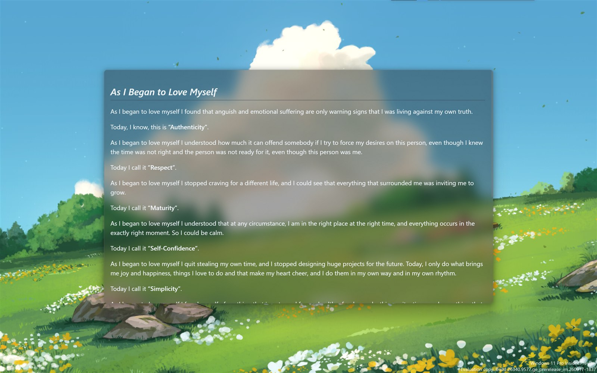
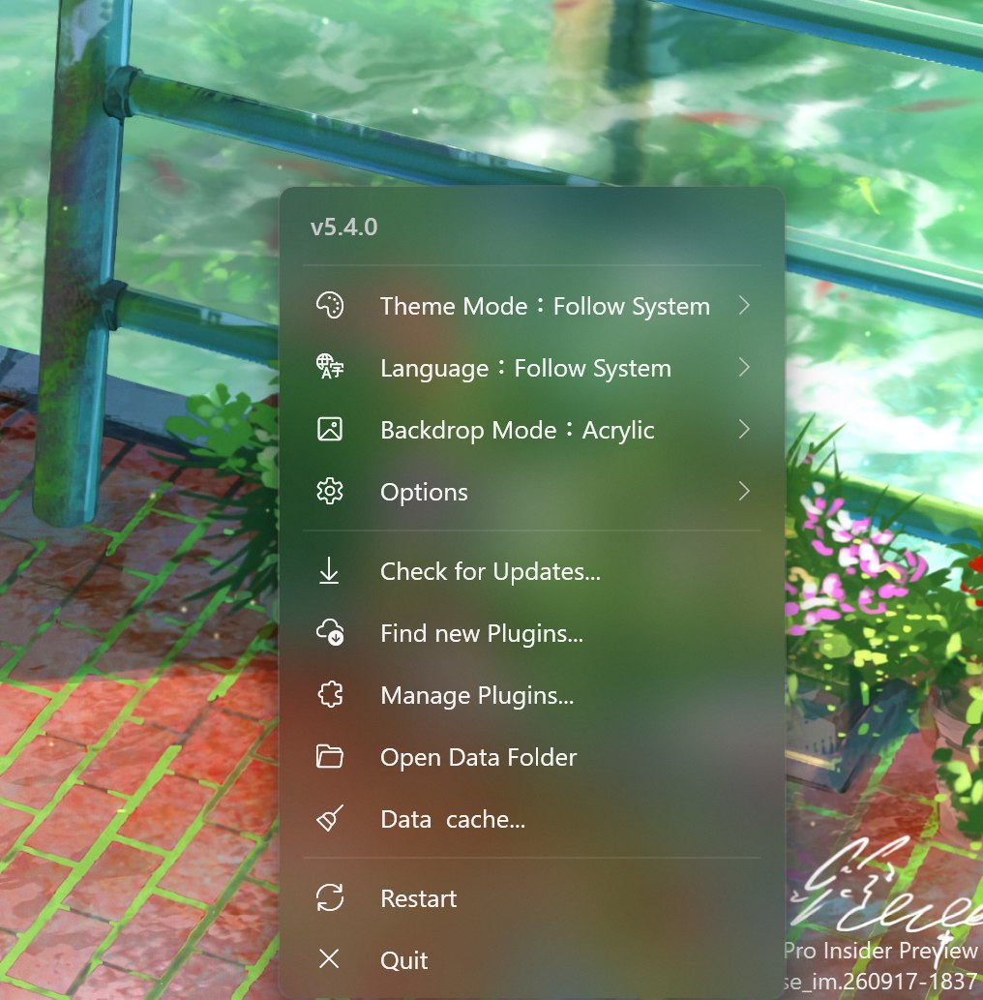
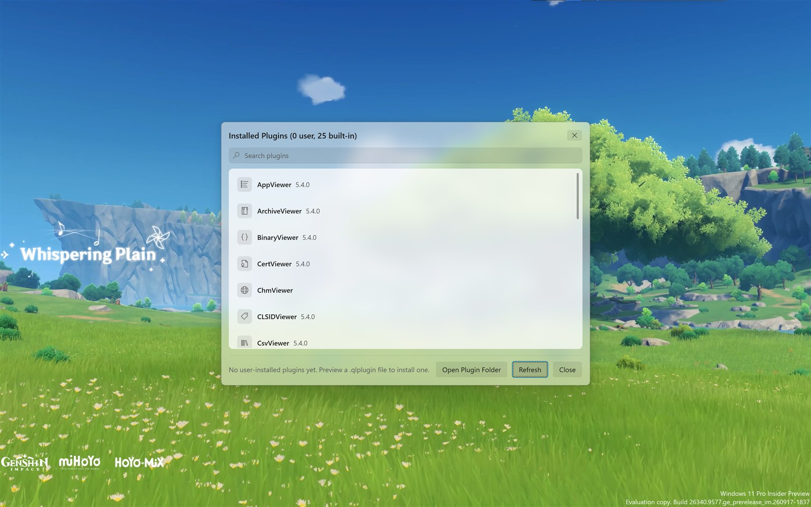

# QuickLook-Next

<p align="center">
  <b>English</b> · <a href="README.zh-CN.md">简体中文</a>
</p>

> **中文用户看这里 → [简体中文 README](README.zh-CN.md)**（GitHub 不会按浏览器语言自动切换。）
>
> 一句话：Windows 上的空格键文件预览工具，QuickLook 的衍生版，免费开源。
> 25 个内置插件覆盖图片 / 视频 / PDF / Office / 压缩包 / 字体 / 数据库 / 3D 等；
> 毛玻璃 + Win11 原生圆角；解压双击即用，需先装 .NET 10 桌面运行时。

> A **UI-polished and feature-complete** edition of [QuickLook](https://github.com/QL-Win/QuickLook)
> (ported to .NET 10, based on the 4.5.0 codebase).

QuickLook-Next keeps the full file-preview capability and rebuilds the experience:
preview backdrop, rounded corners, themes, tray menu, plugin manager, language
switching, auto-update — **more features, not fewer**.

Named pipes and the mutex use the `QuickLookNext.App.*` prefix, so it can be installed
side-by-side with the official build without conflicts.

## Relationship with QuickLook

**QuickLook-Next is a fork of [QL-Win/QuickLook](https://github.com/QL-Win/QuickLook)** — it is not
the official build and is not affiliated with it.

- **Codebase**: upstream 4.5.0, ported to .NET 10 and then reworked.
- **Licence**: GPL-3.0, the same licence as upstream; the licence text and the upstream copyright
  notices are kept.
- **Plugins**: the plugin contract is unchanged (`QuickLook.Common` / `QuickLook.Plugin.*`), so
  plugins written for the original load without recompiling. The 25 built-in plugins come from that
  ecosystem.
- **Side by side**: named pipes and the mutex use the `QuickLookNext.App.*` prefix, so this build and
  the official one can be installed at the same time without interfering.
- **What is this fork's work**: the preview engine is upstream's. The UI layer (acrylic and rounded
  corners, themes, tray menu, plugin manager, caption bar), the self-rendered Office previews, the
  OCR wiring, and the performance, packaging and testing work are this fork's — everything listed
  under [Highlights vs. the original](#highlights-vs-the-original) and
  [New in the 5.x line](#new-in-the-5x-line).

### Side by side with upstream

Both are QuickLook; the difference is which layer the work went into. Upstream owns the preview
engine and the plugin ecosystem, and this fork owns the layer above it.

| | Upstream QuickLook | QuickLook-Next |
|---|---|---|
| Runtime | .NET Framework 4.6.2 | .NET 10 |
| Tray menu | version, check for updates, find plugins, open the data folder, run at startup, close on lost focus, restart, quit | all of those, plus a theme mode, the language list, the backdrop list, "hide top bar", "low memory mode", the plugin manager and the data & cache panel |
| Theme and backdrop | a setting (`WindowBackdrop` is documented in `OPTIONS.md`) | switched straight from the tray menu, and the group header shows the value in use |
| Removing a plugin | upstream's own guide: quit the app, find the data folder, delete the folder by hand | uninstall user plugins in the plugin manager, which lists name, version and origin and has a search box |
| Installing a plugin | download a `.qlplugin` from the wiki in a browser, then preview the file to install it | browse the list inside the panel and install in one click, with the size and SHA-256 verified before anything is written |
| Office preview | the plugin renders through the system preview component | re-implemented in-house (OOXML parsed and rendered in WebView2), so no Office install is needed |
| Image OCR | open upstream request [#1608](https://github.com/QL-Win/QuickLook/issues/1608) | shipped, and the engine is picked per image |
| Cache footprint | open upstream request [#1933](https://github.com/QL-Win/QuickLook/issues/1933) | data & cache panel, clearing only the rebuildable files |
| Large images | open upstream request [#1054](https://github.com/QL-Win/QuickLook/issues/1054) | 40 MP decode cap plus decoded-space zoom accounting |
| Mixed-DPI screens | open upstream request [#827](https://github.com/QL-Win/QuickLook/issues/827) | fixed, with a per-screen diagnostic to check on real hardware |
| Unplayable video | open upstream request [#1768](https://github.com/QL-Win/QuickLook/issues/1768) | a message instead of taking the process down |
| Distribution | Microsoft Store, installer, Scoop, nightly builds | portable zip |

Upstream is ahead on distribution and on the size of its third-party plugin ecosystem, and it is
still actively developed — this fork tracks it rather than replacing it. Where a feature is listed as
new above, the upstream issue that asked for it is named, so the claim can be checked.

## Screenshots

All screenshots below show the app running in real use.

### Image preview

100+ image formats (png / jpg / gif / webp / bmp / psd / raw / heic / svg etc.)
with Acrylic backdrop from the first frame that follows the wallpaper, plus
native Win11 rounded corners.


### Markdown preview

Standard Markdown, mermaid diagrams and MathJax formulas with syntax
highlighting; content scrolls smoothly.



### Office preview (self-rendered; screenshot shows Excel)

Excel / Word / PowerPoint all use in-house rendering (OOXML parsing + WebView2)
instead of the Windows system preview component — no Office installation
required. The screenshot shows Excel as an example.


### PDF preview

Page-by-page PDF browsing with a clean left frame + right paper layout.


### Tray menu (Acrylic)

Frosted tray menu with theme / backdrop / language in submenus and Fluent
icons; clicking an option does not accidentally close the menu.



### Plugin manager

Lists built-in and user plugins; user plugins can be uninstalled directly;
existing plugins load without recompiling.



## Highlights vs. the original

### UI polish

- **Acrylic from the first frame, follows the wallpaper**: the original used DWM
  Acrylic on Win11, but the never-activating preview window rendered a solid tint
  until clicked. QuickLook-Next uses WCA acrylic, so the frosted look is there
  immediately and follows wallpaper changes.
- **Native Win11 rounded corners**: 8 px rounded corners on the glass, no square
  frosted edges.
- **Consistent Acrylic look**: preview window, tray menu and plugin manager all
  use borderless non-layered WCA acrylic + DWM corners.
- **Light / Dark / System themes**: switch from the tray menu, persisted instantly.
- **Auto-hiding top bar**: the caption area only appears when the cursor reaches
  the top of the window.
- **Unified theme colors**: the tray menu and plugin manager share one palette
  (text / separators / hover / accent); the accent follows the system accent color.
- **Theme-aware scrollbars**: scrollbar thumbs follow the light / dark theme in
  the preview window, tray menu and plugin manager.
- **No flicker when switching previews**: the fade-in plays on the first preview
  only; switching files keeps full opacity.
- **Grouped tray menu with icons**: theme / backdrop / language / options live in
  submenus with Fluent icons, keeping the top level short; also fixed menu
  flicker, icon-click menu disappearance and submenu mis-closing.

### Features

- **Self-rendered Office previews**: Excel / Word / PowerPoint no longer use the
  Windows system preview component — they are parsed and rendered in-house
  (MiniExcel / OOXML → styled HTML in WebView2), matching the app's rounded
  corners, acrylic and themes, with a fixed light paper surface for readability.
- **Plugin manager (new)**: lists user and built-in plugins, uninstalls user
  plugins; the plugin contract stays `QuickLook.Common` / `QuickLook.Plugin.*`,
  so existing plugins load without recompiling.
- **Plugin browser (new in 5.6.0)**: the same panel has a **Browse** view that
  lists 43 third-party plugins — publisher, version, size, description — and
  installs one in a click. Nothing is mirrored: every row downloads the file the
  author publishes, and the catalogue pins each entry to its size and SHA-256,
  verifies the download before writing anything, and only installs into the
  `QuickLook.Plugin.*` folder the package's own metadata names. The list is
  refreshed once in the background at every start, and **Refresh Index** in the
  panel re-reads it on demand.
- **Built-in language switching**: follow-system + 30 languages in the tray menu
  (common languages first, names shown in their own language — Chinese displays
  as 简体中文 / 繁体中文), persisted.
- **Auto-update**: downloads the Release package, replaces files and restarts
  in place.
- **Scrollable text preview**: fixed layered-window wheel routing; txt / log /
  json / code previews scroll normally.
- **Faster previews**: a second instance forwards through a named pipe without
  initializing WPF; the image decode pipeline is warmed in the background.

### New in the 5.x line

The 5.x releases are where most of the feature work landed. The upstream issue this
fixes or implements is noted where there is one.

- **Text recognition (OCR)** — *Extract text* sits on the preview toolbar; the result opens in a
  selectable panel with one-click copy. It uses the OCR engine Windows already ships
  (`Windows.Media.Ocr`), so there is nothing extra to download. The engine is picked per image, so a
  Chinese picture is no longer handed to the English engine; small pictures are enlarged before
  recognition, and a mixed-language page keeps both languages. (upstream #1608)
- **Data & cache panel** — the tray menu shows what the app actually occupies (WebView2 caches,
  leftover update files, settings, logs, the WebView2 profile) and clears only the rebuildable
  parts: sign-in data, settings, statistics and logs survive. (upstream #1933)
- **Low memory mode** — the two startup warm-ups become a switch. Measured idle memory on a single
  200% screen: 64 MB with both off, 112–118 MB with the window only, 169–179 MB by default; the
  warm-ups in exchange buy roughly 200 ms per preview. Since 5.6.2 the mode does not slow previewing
  down: the window warm-up follows the preview session, so consecutive previews stay at ~120 ms.
  Since 5.6.3 the memory also really comes back — the tray process restarts itself once you have
  stopped previewing, after a wait you choose under *Release memory* (90 seconds by default, up to
  "never"); measured 67 MB idle before a preview and 69 MB after the release.
- **Huge-image protection** — a 40 MP decode cap, plus zoom and memory accounting in the coordinate
  space the image was actually decoded in: a 64 MP image dropped from a 1705 MB peak to 1156 MB
  without changing how it looks. (upstream #1054)
- **Mixed-DPI multi-monitor fix** — the plugin and the viewer now measure against the *same* screen,
  and every plugin-derived size is clamped to the screen the window lands on, so previewing a large
  landscape image no longer makes the window span three monitors. A display-scaling change re-fits
  the open preview too. (upstream #827; the re-fit also covers #1956)
- **Video robustness** — a video that cannot be opened (damaged, 0-byte, missing decoder) now reports
  that instead of taking the whole app down, verified against a 22-sample matrix of containers,
  codecs and edge cases. (upstream #1768)
- **Accessibility** — reduced motion is honoured (the caption fade, the content fade and the window
  show transition follow the system setting), and icon-only buttons carry names for screen readers.
- **Readability on any wallpaper** — the surfaces you actually read (plugin manager, update prompt,
  download panel, data & cache, OCR) use a 45% panel tint over a content plate rather than the 30%
  menu glass, and fall back to a solid surface when Windows transparency effects are switched off.
- **Plugin manager search** — the panel opens with the caret already in the search box, filters name
  and description as you type, and reports "3 of 25 shown"; Esc clears the filter first and closes
  the panel second.

### Performance & size

- **Faster startup**: plugin assemblies load in parallel and syntax highlighting
  initializes concurrently — plugin-ready time dropped from ~2.5 s to ~0.4 s.
- **On-demand loading**: rare-format plugins (3D, databases, PE, e-mail, ...)
  load only on first use, and the MediaInfo (~8 MB) and ImageMagick (~24 MB)
  native libraries are no longer preloaded; Markdown loads mermaid / MathJax
  only when needed.
- **Leaner package**: runtimes live in `lib\`, shared dependencies are
  deduplicated, the app icon is losslessly compressed (app.ico 1457 KB → 92 KB,
  exe ~1.6 MB → 0.25 MB, ~60 MB zip).

### Engineering

- **.NET 10 migration**: targets `net10.0-windows`; only the .NET SDK is needed
  to build.
- **Pure C# space-key pipeline**: focus detection + Explorer / desktop selection
  reading use P/Invoke + Shell COM, no native C++ toolchain.
- **Name isolation**: `QuickLookNext.App.*` pipes/mutex — installs side-by-side
  with the official build.
- **Build quality**: build warnings cleaned up from 31 to 1.
- **Automated tests**: 19 format previews + shell-selection + tray menu / plugin
  panel ([test.ps1](test.ps1), must stay green); GitHub Actions builds and runs
  the smoke test on every push.

## Install & usage

1. Download the latest release from [Releases](https://github.com/Adstrax/QuickLook-Next/releases),
   extract it and run `QuickLook-Next.exe`.
2. Select a file and press **Space** to preview, **Esc** to close; the preview
   supports always-on-top and drag-and-drop between previews.
3. Right-click the tray icon to switch theme / backdrop / language, manage
   plugins, check for updates, etc.

> **Requirements**: [.NET 10 Desktop Runtime](https://dotnet.microsoft.com/download/dotnet/10.0)
> on Windows 10 / 11. If the runtime is missing, the app shows a download prompt
> — install it and reopen. The app will not start without .NET 10.

## Building

Requires the .NET 10 SDK:

```powershell
dotnet build QuickLookNext.slnx -c Release
```

Run the smoke test before committing: `.\test.ps1` (must pass).

Build a user-friendly release package (the root keeps only `QuickLook-Next.exe`
and a few config files; runtimes live in `lib\`, plugins in `QuickLook.Plugin`,
with portable mode and a first-run readme):

```powershell
.\Scripts\pack-release.ps1 -MakeZip
```

Output: `Build\QuickLook-Next-<version>.zip`:

```
QuickLook-Next.exe
QuickLook-Next.dll / .deps.json / .runtimeconfig.json
Translations.config
Readme.txt           # first-run note (incl. .NET runtime requirement, Chinese)
lib\                 # third-party runtimes
runtimes\            # native runtimes
QuickLook.Plugin\    # built-in plugins
```

## Supported formats

Folder preview is provided by the built-in InfoPanel. 25 built-in plugins cover
everyday and professional formats:

| Plugin | Purpose |
|---|---|
| ImageViewer | Images (png/jpg/gif/webp/bmp/psd/raw/heic/svg/ico and 100+ more) |
| VideoViewer | Video & audio (MediaInfo sniffing; mp4/mkv/avi/mov/webm/mp3/flac etc.) |
| TextViewer | Text & code (txt/log/ini/json/xml/rtf/csv and hundreds of languages) |
| MarkdownViewer | Markdown (md/mdx/mermaid/ipynb/adoc/rst etc.) |
| OfficeViewer | Office (docx/xlsx/pptx self-rendered; doc/xls/ppt/odt/ods/odp/vsd/vsdx via system fallback) |
| HtmlViewer | HTML/MHT/URL (WebView2; dependency of the Markdown plugin) |
| PdfViewer | PDF |
| ArchiveViewer | Archives & installers (zip/rar/7z/tar/gz/bz2/xz/cbz/cbr/jar/apk/msi etc.) |
| CsvViewer | CSV/TSV/PSV tabular view |
| FontViewer | Fonts (ttf/otf/woff/woff2/ttc/eot) |
| MediaInfoViewer | Media info via the context menu |
| CLSIDViewer | Shell special objects (This PC, Recycle Bin, etc.) |
| AppViewer | App package details (apk/ipa/msi/dmg/deb/rpm etc.) |
| PluginInstaller | .qlplugin installation |
| BinaryViewer | Binary files (bin/hex) |
| CertViewer | Certificates (cer/crt/pem/pfx/p12 etc.) |
| ChmViewer | CHM help documents |
| DbViewer | Databases (SQLite etc.) |
| DumpViewer | Crash dumps (dmp) |
| ELFViewer | ELF executables (Linux binaries) |
| HelixViewer | 3D models (stl/obj/3ds/fbx/glb/gltf/dae etc.) |
| MailViewer | E-mail (eml/msg) |
| PEViewer | PE executables (exe/dll/sys etc.) |
| PrefetchViewer | Windows prefetch files (pf) |
| ThumbnailViewer | Design-file thumbnails (cdr/fig/kra/pdn/sketch/xd etc.) |

## Changelog

See [CHANGELOG.md](CHANGELOG.md) and GitHub [Releases](https://github.com/Adstrax/QuickLook-Next/releases).
