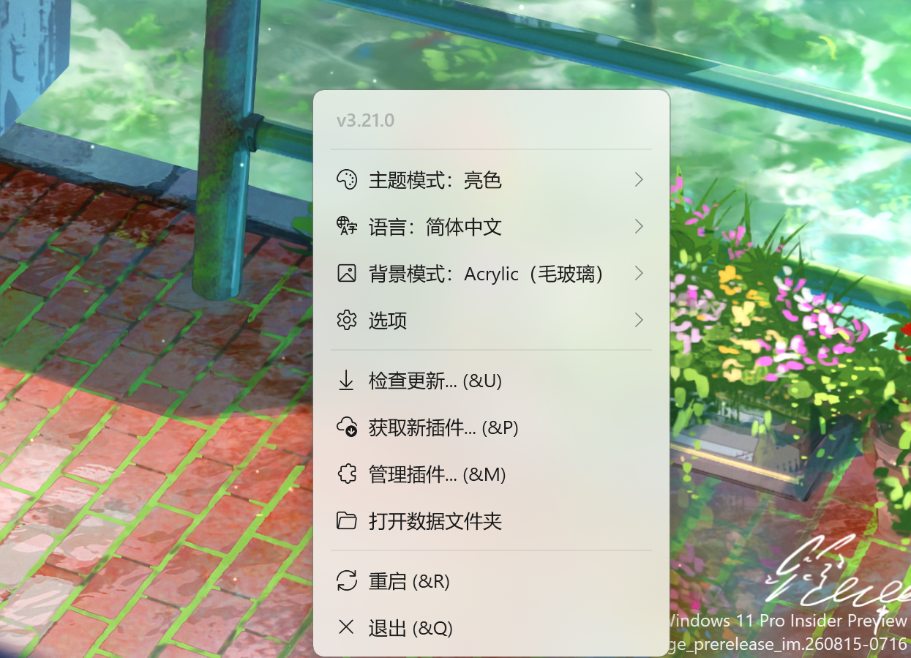
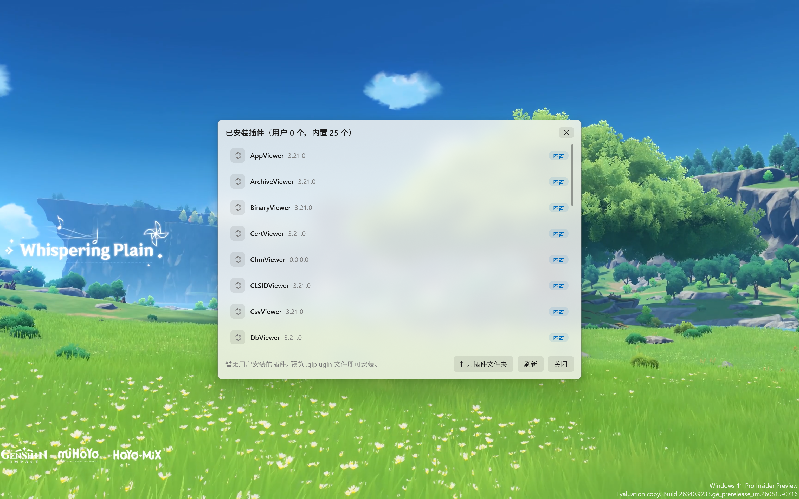

# QuickLook-Next

<p align="center">
  <a href="README.md">English</a> · <b>简体中文</b>
</p>

> QuickLook 的 **UI 美化与功能完善版**（基于 [QL-Win/QuickLook](https://github.com/QL-Win/QuickLook)
> 4.5.0 的 .NET 10 迁移版）。

QuickLook-Next 保留完整的文件预览能力，并把预览背景、窗口圆角、主题、托盘菜单、
插件管理、语言、自动更新等体验全面重构与增强——**功能只多不少**。

与官方完整版命名隔离（管道 / 互斥体使用 `QuickLookNext.App.*`），可同时安装互不干扰。

## 和 QuickLook 是什么关系

**QuickLook-Next 是 [QL-Win/QuickLook](https://github.com/QL-Win/QuickLook) 的衍生版（fork）**，
不是官方版本，也与官方团队无关。

- **代码基线**：上游 4.5.0，迁移到 .NET 10 之后重做。
- **许可证**：与上游一样是 GPL-3.0，许可证正文和上游版权声明一并保留。
- **插件**：插件契约没有改动（仍是 `QuickLook.Common` / `QuickLook.Plugin.*`），
  为原版写的插件不用重新编译就能加载；25 个内置插件也来自这套生态。
- **共存**：管道和互斥体使用 `QuickLookNext.App.*` 前缀，本版本和官方版可以同时安装、互不干扰。
- **哪些是本项目的改动**：预览引擎是上游的功劳；UI 层（毛玻璃与圆角、主题、托盘菜单、
  插件管理、顶栏）、自研 Office 预览、OCR 接线，以及性能、打包和测试相关的工程工作属于本项目，
  也就是下面「相比原版的主要改进」与「5.x 新增能力」列出的内容。

### 与上游逐项对比

两边都是 QuickLook，区别在于改动落在哪一层：预览引擎和插件生态是上游的，本项目做的是它们上面那一层。

| | 上游 QuickLook | QuickLook-Next |
|---|---|---|
| 运行时 | .NET Framework 4.6.2 | .NET 10 |
| 托盘菜单 | 版本号、检查更新、查找插件、打开数据目录、开机启动、失焦关闭、重启、退出 | 以上各项（「查找插件」已并入插件面板的可安装页），外加主题模式、语言列表、背景材质列表、「顶栏默认隐藏」、低内存模式分组（关闭 / 90 秒 / 5 分钟 / 15 分钟 / 1 小时 / 从不）、插件管理面板和数据与缓存面板 |
| 主题与背景材质 | 设置项（`WindowBackdrop` 写在 `OPTIONS.md` 里） | 托盘菜单直接切换，组标题显示当前选中的值 |
| 卸载插件 | 上游官方说明：退出程序 → 找到数据目录 → 手动删文件夹 | 在插件管理面板里卸载用户插件，面板列出名称、版本、来源，并带搜索框 |
| 安装插件 | 到 wiki 用浏览器下载 `.qlplugin`，再通过预览该文件来安装 | 在面板里直接浏览列表并一键安装，写入前先核对体积与 SHA-256 |
| Office 预览 | 插件走系统预览组件 | 自研解析渲染（OOXML 解析后在 WebView2 里排版），不需要装 Office |
| 图片 OCR | 上游仍未完成的 [#1608](https://github.com/QL-Win/QuickLook/issues/1608) | 已实现，且按图片挑选识别引擎 |
| 缓存占用 | 上游仍未完成的 [#1933](https://github.com/QL-Win/QuickLook/issues/1933) | 数据与缓存面板，只清理可重建的文件 |
| 大图预览 | 上游仍未完成的 [#1054](https://github.com/QL-Win/QuickLook/issues/1054) | 40 MP 解码上限 + 按解码尺寸做缩放记账 |
| 混合 DPI 多显示器 | 上游仍未完成的 [#827](https://github.com/QL-Win/QuickLook/issues/827) | 已修，并提供逐屏诊断开关供真机复核 |
| 打不开的视频 | 上游仍未完成的 [#1768](https://github.com/QL-Win/QuickLook/issues/1768) | 给出提示而不是让进程退出 |
| 分发方式 | 微软商店、安装包、Scoop、每夜版 | 便携 zip |

上游在分发渠道和第三方插件生态的规模上更成熟，项目本身也一直在更新——本项目是跟随它，而不是取代它。
上面标注为「新增」的条目都写明了对应的上游 issue，可以逐条核对。

## 界面一览

以下截图均来自实际运行效果。

### 图片预览

支持 png / jpg / gif / webp / bmp / psd / raw / heic / svg 等 100+ 图片格式；
Acrylic 毛玻璃背景一打开即生效并跟随壁纸，窗口带 Win11 原生圆角。


### Markdown 预览

支持标准 Markdown、mermaid 图表与 MathJax 公式，代码高亮；内容可上下滚动，
阅读体验流畅。


### Office 预览（自研渲染，截图以 Excel 为例）

Excel / Word / PowerPoint 均不再调用 Windows 系统预览组件，改为 OOXML 解析 +
WebView2 自研渲染；固定浅色纸面、阅读舒适，圆角与主题和整体界面一致，
无需安装 Office。


### PDF 预览

逐页浏览 PDF，左侧框架区 + 右侧纸面布局清晰，阅读舒适。


### 托盘菜单（Acrylic）

毛玻璃托盘菜单，主题 / 背景 / 语言等收进二级子菜单，条目带 Fluent 图标；
点击选项不会误关菜单。



### 插件管理面板

列出内置与用户插件，用户插件可直接卸载；老插件无需重新编译即可安装加载。



## 相比原版的主要改进

### UI 美化

- **Acrylic 一打开即生效、跟随壁纸**：原版在 Win11 上使用 DWM Acrylic，而预览窗口
  从不抢焦点，导致文本 / 代码等内容打开时是纯色、点击后才出现毛玻璃。QuickLook-Next
  改用 WCA 方案，打开即是毛玻璃，且桌面壁纸变化时背景同步变化
- **Win11 原生圆角**：毛玻璃与内容一起 8px 圆角，没有方形毛玻璃边角
- **统一 Acrylic 观感**：预览窗口、托盘菜单、插件管理面板同为无边框非分层
  WCA 毛玻璃 + DWM 圆角，没有方形毛玻璃边角，也没有多余的外圈投影
- **亮色 / 暗色 / 跟随系统**：托盘菜单一键切换并持久化，预览立即生效
- **顶部状态栏默认隐藏**：鼠标移到窗口顶部标题栏区域才显示，移开后自动隐藏，
  不遮挡内容
- **主题色统一**：托盘菜单与插件管理面板共享同一套调色板，文字 / 分隔线 /
  悬停 / 强调色单一来源，强调色跟随系统主题色
- **滚动条随主题**：预览窗口、托盘菜单、插件管理面板的滚动条滑块颜色随
  亮 / 暗主题变化
- **切换预览无闪烁**：内容淡入动画只在首次预览时触发，切换文件时保持全不透明度
- **托盘菜单分组 + 图标**：主题模式、背景模式、语言、选项收进二级子菜单，
  顶层保持简短，条目带 Fluent 图标；同时修复了菜单闪动、点击图标菜单消失、
  二级菜单误关等问题

### 功能完善

- **Office 三件套自研渲染**：Excel / Word / PowerPoint 不再调用 Windows 系统预览
  组件，改为自研解析渲染（MiniExcel / OOXML 解析 → WebView2），获得圆角、毛玻璃、
  深浅色一致的观感，且内容固定浅色纸面、阅读舒适
- **插件管理面板（原版没有）**：列出用户安装与内置插件，用户插件可直接卸载；
  插件契约保持 `QuickLook.Common` / `QuickLook.Plugin.*`，老插件无需重新编译即可
  安装加载
- **插件市场（5.6.0 新增）**：同一个面板多了「可安装」视图，列出 43 个第三方插件
  （发布者、版本、体积、说明），一键安装。仓库不转存任何插件文件：每一行下载的都是作者
  自己发布的 `.qlplugin`；索引固定了体积与 SHA-256，写入前先校验，且只允许解压到包内
  元数据声明的 `QuickLook.Plugin.*` 目录。列表在每次启动时后台刷新一次，面板里的
  「刷新索引」也可以随时重新拉取；标签页右侧的「更多插件 ↗」会在浏览器中打开上游 wiki，
  承接索引里没有的老插件——原来托盘菜单的「查找新插件」就并到这里了
- **内置语言切换**：托盘菜单「语言」子菜单支持跟随系统 + 30 种语言（常用语言
  优先排序），显示名使用本地语言（中文显示为「简体中文」「繁体中文」），
  选择后持久化
- **自动更新**：检查更新时直接下载 Release 安装包并原地更新重启，不再只是打开网页
- **文本预览可上下滚动**：修复分层窗口收不到滚轮消息的问题，txt / log / json /
  代码等预览可正常滚动
- **预览打开提速**：第二实例不再初始化 WPF，直接通过命名管道转发给常驻实例；
  图片解码管线在启动后台预热，首次预览不再支付一次性初始化成本

### 5.x 新增能力

功能性改动大多落在 5.x。对应到的上游 issue 一并标在括号里。

- **图片文字识别（OCR）**——预览工具栏上的「提取文字」，结果在可选中、可一键复制的面板里。
  用的是 Windows 自带的 OCR 引擎（`Windows.Media.Ocr`），不需要额外下载。识别引擎按图片挑选，
  中文图片不会再被丢给英文引擎；小图先放大再识别；中英混排的页面两种语言都会保留。（上游 #1608）
- **数据与缓存面板**——托盘菜单里能看到程序到底占了多少（WebView2 缓存、更新残留、设置、日志、
  WebView2 配置文件），并且只清理可重建的部分：登录状态、设置、统计和日志都会保留。（上游 #1933）
- **省内存模式**——把启动时的两项预热做成开关。本机单屏 200% 实测空闲内存：全关 64 MB、
  只留窗口预热 112–118 MB、默认 169–179 MB；预热换来的收益是每次预览快约 200 ms。
  （5.6.2 起该模式不会再拖慢预览：窗口预热改为跟随预览会话，连续预览保持约 120 ms；
  5.6.3 起内存也真的会还回去——停手后按「低内存模式」里选定的时长自动重启一次托盘进程，
  默认 90 秒，也可选 5 分钟 / 15 分钟 / 1 小时 / 从不。实测预览前空闲 67 MB、
  释放后 69 MB。）
- **大图保护**——默认 40 MP 解码上限，同时把缩放与内存记账放在「实际解码后的坐标空间」里：
  6400 万像素图片的峰值从 1705 MB 降到 1156 MB，观感不变。（上游 #1054）
- **混合 DPI 多显示器修复**——插件与窗口现在以**同一块屏幕**为基准测量，插件给出的尺寸会被夹取到
  窗口即将落上的那块屏，预览大横图不再横跨三块显示器；屏幕缩放变化后也会重新贴合。
  （上游 #827，重新贴合同时覆盖 #1956）
- **视频健壮性**——打不开的视频（损坏、0 字节、缺解码器）会给出提示，而不是把整个程序带崩，
  已经用 22 个样本（容器 / 编码 / 边界情况）跑过一轮。（上游 #1768）
- **←/→ 切换文件**——资源管理器持有焦点时方向键移动选区、预览跟随，和 macOS Quick Look 一致；
  点进预览窗口后方向键重新归插件（视频快进、PDF 翻页），两者不会打架。
- **无障碍**——遵循系统「减少动态效果」（顶栏渐显、内容渐显、窗口显示动画都会跟随），
  纯图标按钮带上了给读屏软件用的名称。
- **任何壁纸下都能看清**——需要阅读的面板（插件管理、更新提示、下载进度、数据与缓存、OCR）
  改用 45% 面板底色 + 内容底板，而不是托盘菜单那层 30% 玻璃；Windows 关闭透明效果时回落到纯色。
- **插件管理搜索**——面板打开即聚焦搜索框，边输入边过滤名称与描述，状态栏显示「显示 25 个中的 3 个」；
  Esc 先清掉过滤、再关闭面板。

### 性能与体积

- **启动提速**：25 个插件程序集并行加载、语法高亮并行初始化，插件就绪时间从约
  2.5s 降到约 0.4s
- **按需加载**：罕见格式插件（3D、数据库、PE、邮件等）首次遇到才加载，常驻内存
  与原生库占用更低（MediaInfo 约 8MB、ImageMagick 约 24MB 原生库不再预载）；
  Markdown 预览按需加载 mermaid / MathJax；字体预览（FontViewer）同样按需加载，
  FreeType / OpenFont 依赖不再常驻
- **预览匹配缓存**：同一扩展名重复预览跳过全量插件扫描（结果与全量扫描一致），
  插件 Init 后台并行化，程序集索引启动期后台预建
- **画刷缓存**：托盘菜单 / 插件面板调色板画刷复用并冻结，减少反复分配
- **发布包精简**：运行库统一收进 `lib\`，共享依赖去重，应用图标无损压缩
  （app.ico 1457KB → 92KB，exe 约 1.6MB → 0.25MB，zip 约 60MB）

### 工程与架构

- **.NET 10 迁移**：目标框架 net10.0-windows，构建只需 .NET SDK
- **纯 C# 空格键链路**：焦点判断 + Explorer / 桌面选区读取改为 P/Invoke + Shell COM，
  不再依赖原生 C++ 工具链
- **命名隔离**：管道 / 互斥体使用 `QuickLookNext.App.*`，与官方完整版互不干扰
- **构建质量**：构建警告从 31 个清理到 1 个
- **自动化测试**：19 种格式预览 + Shell 选区链路 + 托盘菜单/插件面板
  （[test.ps1](test.ps1)，提交前必须全绿）；GitHub Actions 在每次推送自动构建并
  运行冒烟测试

## 安装与使用

1. 从 [Releases](https://github.com/Adstrax/QuickLook-Next/releases) 下载最新版，解压后运行
   `QuickLook-Next.exe`
2. 选中文件按 **空格** 预览，**Esc** 关闭；预览窗口支持置顶、跨预览拖拽内容
3. 托盘图标右键可切换主题 / 背景 / 语言、管理插件、检查更新等

> **系统要求**：需要 [.NET 10 Desktop Runtime](https://dotnet.microsoft.com/download/dotnet/10.0)
> （Windows 10 / 11）。如果启动时提示缺少运行时，点击提示中的下载按钮安装后
> 重新打开即可；未安装 .NET 10 时应用不会启动。

## 构建

需要 .NET 10 SDK：

```powershell
dotnet build QuickLookNext.slnx -c Release
```

提交前运行冒烟测试：`.\test.ps1`（要求全部通过）。

生成用户友好的发布包（根目录只保留 `QuickLook-Next.exe` 和少量配置文件，
其余运行库收进 `lib\` 子目录，插件在 `QuickLook.Plugin` 子目录，自带便携模式与
首次使用说明）：

```powershell
.\Scripts\pack-release.ps1 -MakeZip
```

产物：`Build\QuickLook-Next-<版本号>.zip`，解压后结构如下，用户只需双击根目录的
`QuickLook-Next.exe`：

```
QuickLook-Next.exe
QuickLook-Next.dll / .deps.json / .runtimeconfig.json
Translations.config
Readme.txt          # 首次使用说明（含 .NET 运行时要求，中文）
lib\               # 第三方运行库
runtimes\          # 原生运行库
QuickLook.Plugin\  # 内置插件
```

## 支持的文件格式

文件夹预览由主程序内置的 InfoPanel 提供，内置 25 个插件（含恢复的 11 个
插件），覆盖日常与专业格式：

| 插件 | 用途 |
|---|---|
| ImageViewer | 图片（png/jpg/gif/webp/bmp/psd/raw/heic/svg/ico 等 100+ 格式） |
| VideoViewer | 视频与音频（MediaInfo 嗅探，支持 mp4/mkv/avi/mov/webm/mp3/flac 等） |
| TextViewer | 文本与代码（txt/log/ini/json/xml/rtf/csv 及数百种代码语言） |
| MarkdownViewer | Markdown（md/mdx/mermaid/ipynb/adoc/rst 等） |
| OfficeViewer | Office（docx/xlsx/pptx 自研渲染；doc/xls/ppt/odt/ods/odp/vsd/vsdx 系统兜底） |
| HtmlViewer | HTML/MHT/URL（WebView2 渲染，也是 MD 插件的依赖） |
| PdfViewer | PDF |
| ArchiveViewer | 压缩包与安装包（zip/rar/7z/tar/gz/bz2/xz/cbz/cbr/jar/apk/msi 等） |
| CsvViewer | CSV/TSV/PSV 表格化视图 |
| FontViewer | 字体（ttf/otf/woff/woff2/ttc/eot） |
| MediaInfoViewer | 右键菜单查看媒体信息 |
| CLSIDViewer | 系统 shell 特殊对象（我的电脑、回收站等） |
| AppViewer | 应用安装包详情（apk/ipa/msi/dmg/deb/rpm 等） |
| PluginInstaller | .qlplugin 插件安装 |
| BinaryViewer | 二进制文件（bin/hex） |
| CertViewer | 数字证书（cer/crt/pem/pfx/p12 等） |
| ChmViewer | CHM 帮助文档 |
| DbViewer | 数据库（SQLite 等） |
| DumpViewer | 崩溃转储（dmp） |
| ELFViewer | ELF 可执行文件（Linux 二进制） |
| HelixViewer | 3D 模型（stl/obj/3ds/fbx/glb/gltf/dae 等） |
| MailViewer | 邮件（eml/msg） |
| PEViewer | PE 可执行文件（exe/dll/sys 等） |
| PrefetchViewer | Windows 预读取文件（pf） |
| ThumbnailViewer | 设计文件缩略图（cdr/fig/kra/pdn/sketch/xd 等） |

## 更新历史

详细更新记录见 [CHANGELOG.md](CHANGELOG.md) 与 GitHub [Releases](https://github.com/Adstrax/QuickLook-Next/releases)。
